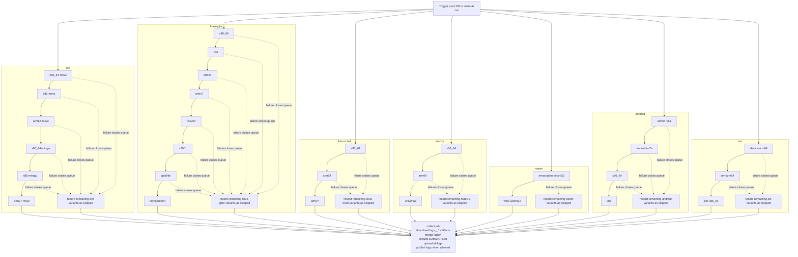

# CI Flow

## Status

This file describes the workflow that is now implemented in `.github/workflows/build.yml`.

The CI has seven visible platform groups plus the final log collector:

- `win`
- `linux-glibc`
- `linux-musl`
- `macos`
- `wasm`
- `android`
- `ios`
- `collect`

Each variant is now its own GitHub Actions job, so the Actions UI shows internal variant progress directly instead of hiding it inside one long per-platform step.

## Current Behavior

- The workflow starts one queue per platform group in parallel.
- Inside a platform group, variants are chained one after another as visible jobs.
- The first failed variant closes that platform queue.
- Remaining jobs in that platform queue still run, but they record `status: skipped` logs instead of attempting a build.
- Each visible variant uploads `bin/<platform>/<variant>/` as its binary artifact.
- Each visible variant uploads `logs/<platform>/<variant>/` as its log artifact.
- `collect` always runs, merges the per-variant log artifacts back into `logs/<platform>/<variant>/`, regenerates per-platform `SUMMARY.txt`, uploads `all-logs`, and publishes only `logs/` back to the repo when the run is on `main` or `master` and not a pull request.
- The job summary now tells the truth: it distinguishes between repo publication, no-op publication, artifact-only runs, and publish failures.

Binaries are uploaded as CI artifacts only. The repository publish step commits logs only.

## Platform Queues

- `win`: `x86_64-msvc -> x86-msvc -> arm64-msvc -> x86_64-mingw -> x86-mingw -> armv7-msvc`
- `linux-glibc`: `x86_64 -> x86 -> arm64 -> armv7 -> riscv64 -> s390x -> ppc64le -> loongarch64`
- `linux-musl`: `x86_64 -> arm64 -> armv7`
- `macos`: `x86_64 -> arm64 -> universal`
- `wasm`: `emscripten-wasm32 -> wasi-wasm32`
- `android`: `arm64-v8a -> armeabi-v7a -> x86_64 -> x86`
- `ios`: `device-arm64 -> sim-arm64 -> sim-x86_64`

## Layout Contract

- Logs: `logs/<platform>/<variant>/`
- Binaries: `bin/<platform>/<variant>/`

Each successful variant is expected to stage at least one matching artifact into its own variant bin directory.
If a build exits successfully but stages nothing into that directory, `build/ci_runner.py` records the variant as failed.

## Mermaid

## Notes

- The reusable workflow lives in `.github/workflows/build-variant.yml`.
- Queue stop behavior is enforced by workflow chaining and by `build/ci_skip.py` for blocked variants.
- Log normalization in `collect` is handled by `build/ci_merge_logs.py`.
- Direct local `build.py` adapters are still narrower than the CI matrix; CI-only profiles are driven through `build/ci_runner.py` plus toolchain setup in the workflow.
