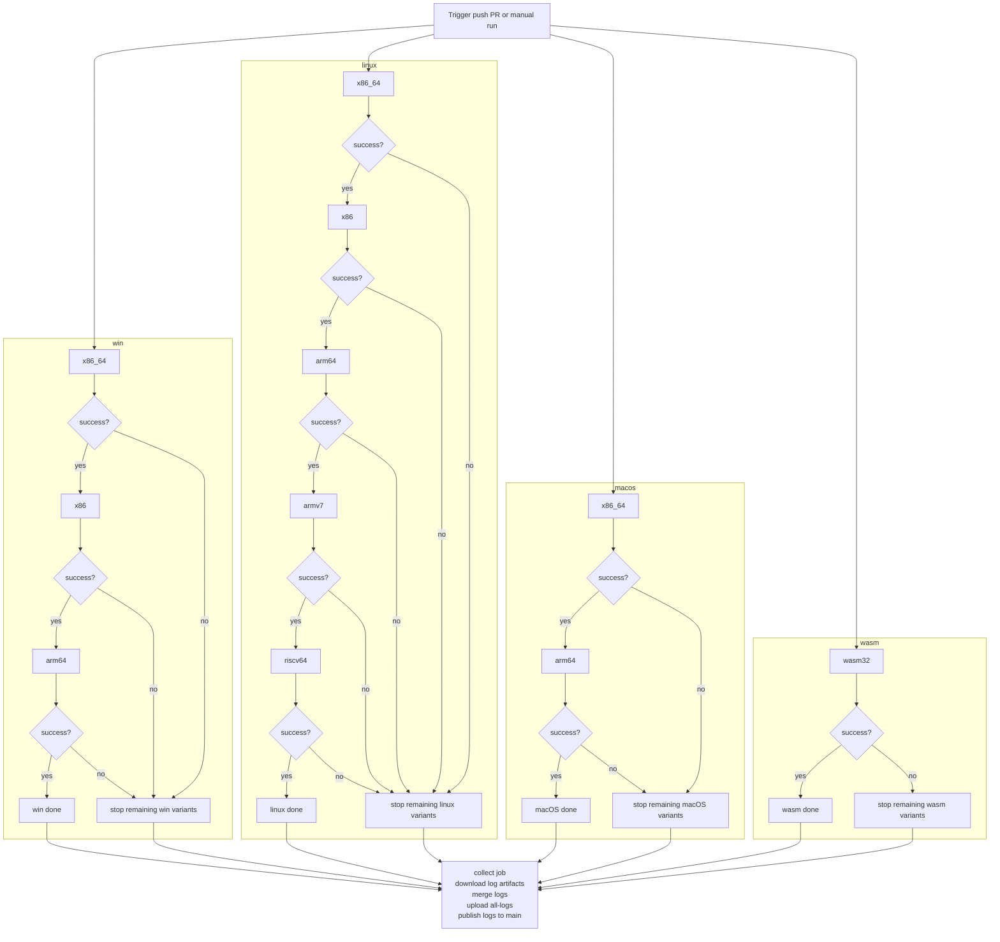

# CI Flow

## Status

This file now describes the workflow that is actually implemented in `.github/workflows/build.yml`.

The current CI only runs four platform jobs plus the final log collector:

- `win`
- `linux`
- `macos`
- `wasm`
- `collect`

The broader seven-platform matrix in `BINARY.md` is not fully implemented in code yet.

## Current Behavior

- The workflow starts the four implemented platform jobs in parallel.
- Each platform job initializes its own log directory and then calls `build/ci_runner.py`.
- Variants run one by one inside that platform job.
- The first failed variant stops the rest of that platform queue and later variants are recorded as skipped.
- Each platform uploads `bin/<platform>/` as a CI artifact and uploads `logs/<platform>/` as a log artifact.
- `collect` always runs, merges the downloaded log artifacts, uploads `all-logs`, and publishes only `logs/` back to `main`.

There is no standalone `main` prep job in the current workflow.
There are no current workflow jobs for `linux-musl`, `android`, or `ios`.
Binaries are uploaded as CI artifacts only; the repository publish step commits logs only.

## Implemented Variant Queues

- `win`: `x86_64 -> x86 -> arm64`
- `linux`: `x86_64 -> x86 -> arm64 -> armv7 -> riscv64`
- `macos`: `x86_64 -> arm64`
- `wasm`: `wasm32`

## Layout Contract

- Logs: `logs/<platform>/<variant>/`
- Binaries: `bin/<platform>/<variant>/`

Each successful native variant is now expected to leave an actual library file under its own variant bin directory.
If a build exits successfully but stages no artifact into that directory, `build/ci_runner.py` treats the variant as failed.

## Mermaid

## Not Yet Implemented

These platform groups exist in `BINARY.md`, but they are not wired into the current workflow or the platform adapter code:

- `linux-musl`
- `android`
- `ios`

They are not impossible on GitHub-hosted runners, but each one still needs real build support in this repo before it should appear in the current flow chart:

- `linux-musl` needs musl toolchains and a dedicated runner branch.
- `android` needs NDK-based build adapters and artifact normalization.
- `ios` needs macOS-only SDK and simulator/device build adapters.

Until those adapters exist, they should stay out of the current CI flow description.
