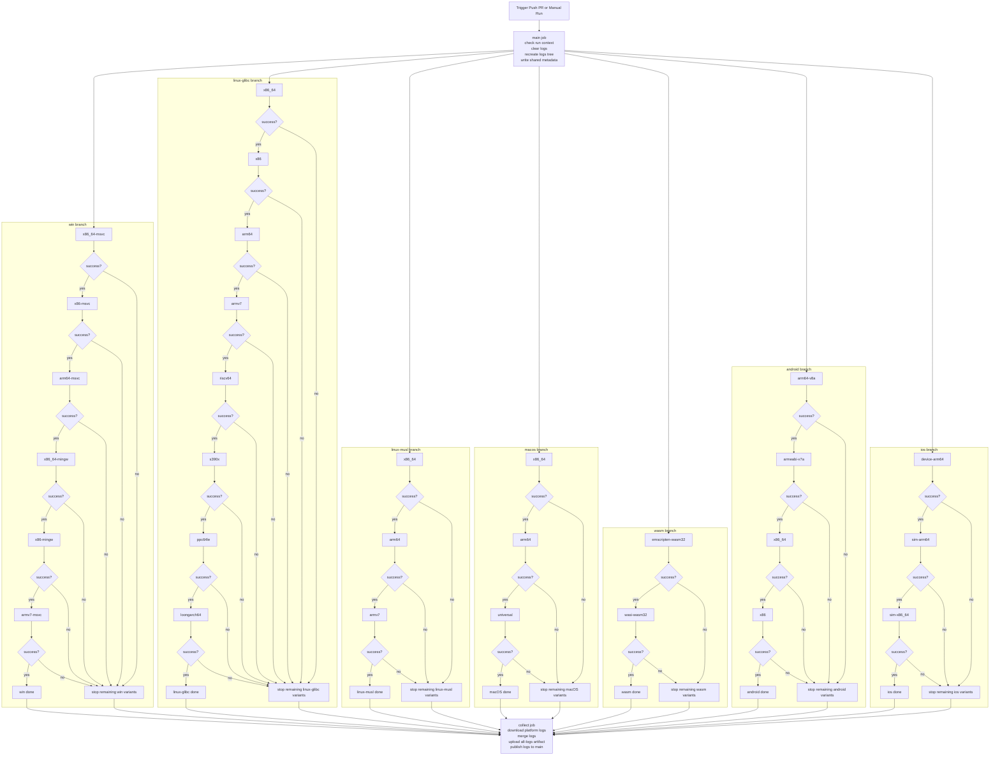

# CI Flow

## Status

This file is a review draft for the full CI topology.

It now covers all seven platform groups from `BINARY.md` and all twenty-nine listed variants.

It describes the target workflow behavior, not the current runner behavior.

Android and iOS are still marked optional in `BINARY.md`, but they are included here so the full branch shape and variant order are defined in one place.

## Goals

- Keep logs mandatory for every CI run.
- Clear stale logs at the beginning of the run.
- Keep log layout as `logs/<platform>/<variant>/`.
- Keep staged binary layout as `bin/<platform>/<variant>/`.
- Cover all 7 platform groups and all 29 variants from `BINARY.md`.
- Run only one active variant per platform at a time.
- Run all enabled platform groups in parallel after `main` finishes.
- Stop the remaining variants of a platform after the first failure in that platform.
- Always publish all collected logs at the end, even if one or more platforms fail early.

## Normalized Platform IDs

To keep CI layout consistent, the flow should use these platform IDs:

- `win`
- `linux-glibc`
- `linux-musl`
- `macos`
- `wasm`
- `android`
- `ios`

`BINARY.md` remains the source for the platform matrix and artifact details.
This flow file defines the normalized CI branch and variant IDs.

## Target Shape

The workflow should be split into these stages:

1. `main`
2. `win`
3. `linux-glibc`
4. `linux-musl`
5. `macos`
6. `wasm`
7. `android`
8. `ios`
9. `collect`

`main` runs first.

Its job is to:

- validate the run context
- clear old `logs/` content for a clean run
- recreate the base log folders
- write shared run metadata

After `main` succeeds, the seven platform branches can start in parallel:

- `win`
- `linux-glibc`
- `linux-musl`
- `macos`
- `wasm`
- `android`
- `ios`

Inside each platform job, variants run one by one.

When all seven platform groups are enabled, the maximum active build count should be seven:

- one Windows variant
- one Linux glibc variant
- one Linux musl variant
- one macOS variant
- one WASM variant
- one Android variant
- one iOS variant

If `main` fails, the platform branches should not start, but `collect` should still publish the `main` logs.

## Variant Queues

The queue order should favor the most representative supported build first, then continue to the other variants for that platform.

- `win`: `x86_64-msvc -> x86-msvc -> arm64-msvc -> x86_64-mingw -> x86-mingw -> armv7-msvc`
- `linux-glibc`: `x86_64 -> x86 -> arm64 -> armv7 -> riscv64 -> s390x -> ppc64le -> loongarch64`
- `linux-musl`: `x86_64 -> arm64 -> armv7`
- `macos`: `x86_64 -> arm64 -> universal`
- `wasm`: `emscripten-wasm32 -> wasi-wasm32`
- `android`: `arm64-v8a -> armeabi-v7a -> x86_64 -> x86`
- `ios`: `device-arm64 -> sim-arm64 -> sim-x86_64`

Notes:

- `macos/universal` should run only after both thin macOS builds succeed in sequence.
- `ios` variants produce static libraries, but they should still use the same log structure.
- `wasm` currently has a legacy `bin/web/` builder output in parts of the repo; CI staging should normalize that into `bin/wasm/<variant>/` before upload.

## Failure Rule

This is the rule to follow:

- start the first variant in each enabled platform branch
- if a variant succeeds, continue to the next variant in that same branch
- if a variant fails, stop the remaining variants in that same branch
- do not stop the other platform branches because of one platform failure
- always keep the logs already produced by the failed branch
- always run the final log collection and publish step

This changes the old behavior.

The old flow kept running later variants in the same platform after a failure.
The target flow must not do that.

## Log Contract

The workflow should still write logs in a durable way.

Required files:

- `logs/main/bootstrap.log`
- `logs/main/job_info.txt`
- `logs/<platform>/bootstrap.log`
- `logs/<platform>/job_info.txt`
- `logs/<platform>/<variant>/configure.log`
- `logs/<platform>/<variant>/build.log`
- `logs/<platform>/<variant>/env.txt`
- `logs/<platform>/<variant>/job_info.txt`
- `logs/<platform>/<variant>/result.txt`

If a platform stops early, the failed variant must still write its result file.

Skipped variants must not create fake success logs.
If explicit skip tracking is desired, a skipped variant directory should contain only a small `result.txt` with `status: skipped` and the skip reason.

## Publish Rule

The last stage is `collect`.

`collect` must run with `always()` semantics so logs are still published when:

- `main` fails
- one variant fails
- one platform stops early
- multiple platforms fail in the same run

The `collect` stage should:

- download all log artifacts created by the platform jobs
- merge them into the flat repository layout
- upload a combined log artifact
- publish the merged `logs/` tree back to `main`

## Mermaid Review Chart

## Review Notes

This draft now matches the full matrix:

- 7 platform groups
- 29 total variants
- one active variant per platform branch
- stop-on-first-failure inside a branch
- final log publish still runs for partial and failed runs

## Local Validation Idea

When this flow is implemented, the runner should be tested with cases like:

- fail `win/x86_64-msvc` and confirm the rest of the Windows queue is skipped
- fail `linux-glibc/arm64` and confirm `armv7`, `riscv64`, `s390x`, `ppc64le`, and `loongarch64` are skipped
- fail `linux-musl/x86_64` and confirm the musl queue stops without affecting the glibc queue
- fail `macos/arm64` and confirm `universal` is skipped
- let `wasm/emscripten-wasm32` pass and `wasm/wasi-wasm32` fail, then confirm only the WASM queue stops
- let Android fail while iOS continues, then confirm `collect` still publishes logs from every branch
