# Missing Cryptographic Domains

This file documents crypto domains NOT yet in ALGO.md, with proof they don't fundamentally collide with existing algorithms.

---

## 1. Zero-Knowledge Proofs (ZKP)

**What it is:** Proofs that verify a statement is true without revealing any information beyond validity.

**Math Example:**

```
Prover knows x such that Hash(x) = H (preimage resistance)
  Prover: x → [compute proof π] → Verifier
  Verifier: check Verify(H, π) = true/false

  Property: π reveals ZERO about x

Example: zkSNARK
  CRS: (G1, G2, [s·G1, s²·G1, ..., sⁿ·G1])
  Proof π = (π₁, π₂) where π₁ = [C + H(public)·s]·(1/(x+α))
  Verification: e(π₂, G₁) = e(C + public·α, π₁)  (pairing check)
```

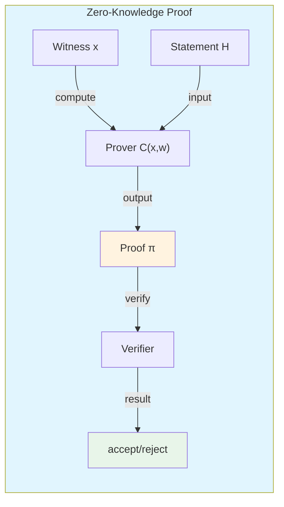

**Non-collision proof:**

- Uses hash functions for Merkle trees/commitments, BUT adds new property: "proof of knowledge"
- NOT fundamental collision: Adds zero-knowledge property that hash/signature algos don't have

**OpenSSL:** Not supported (external libs: libsnark, zcash)

---

## 2. Functional Encryption (FE)

**What it is:** Encryption allowing fine-grained access control - decrypt different ciphertexts to different authorization levels.

**Math Example:**

```
Standard Encryption:
  CT = Enc(k, m) → Dec(k, CT) = m  (ALL or NOTHING)

Functional Encryption:
  CT = Enc(pk, m) with attributes a
  Dec(sk_attr, CT) = f(m) where f depends on attr match
```

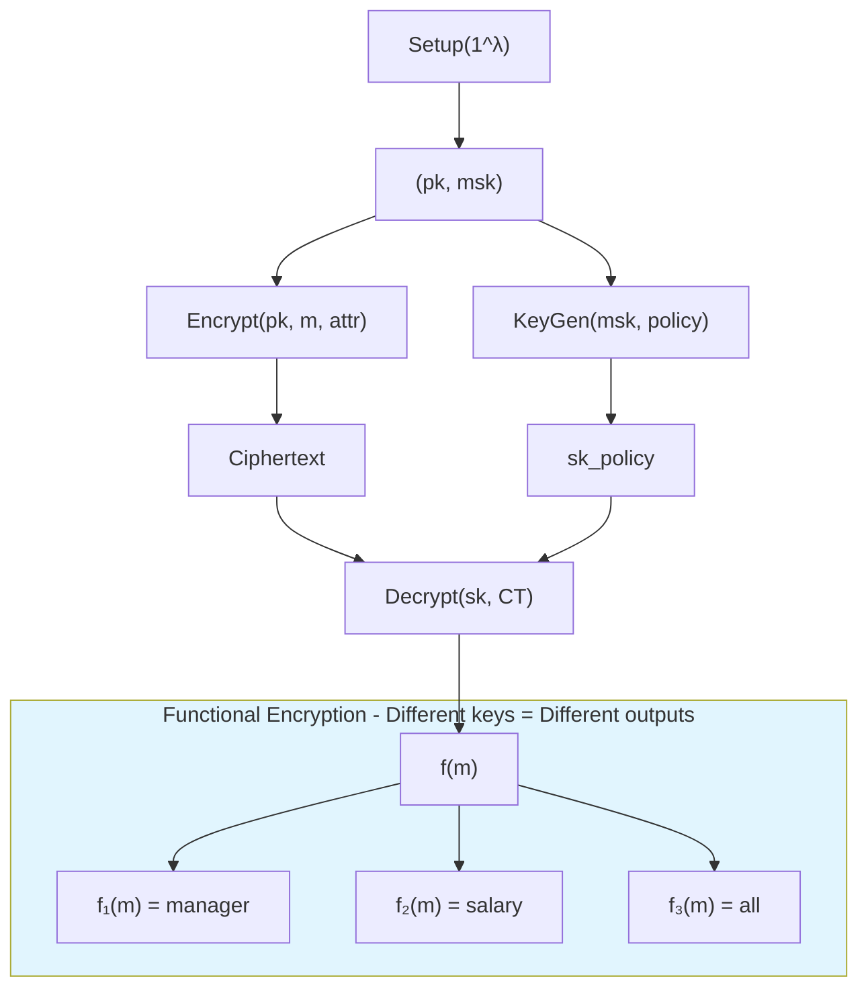

**OpenSSL:** Not supported

---

## 3. Private Set Intersection (PSI)

**What it is:** Protocol for two parties to find intersection of datasets without revealing each party's private data.

**Math Example:**

```
Party A: Set S = {a₁, a₂, ..., aₙ}
Party B: Set T = {b₁, b₂, ..., bₘ}

PSI Protocol (hash-based):
  1. A sends: Hash(aᵢ) for all aᵢ ∈ S
  2. B computes: Check if Hash(aᵢ) ∈ Hash(T)
  3. Output: |S ∩ T|
```

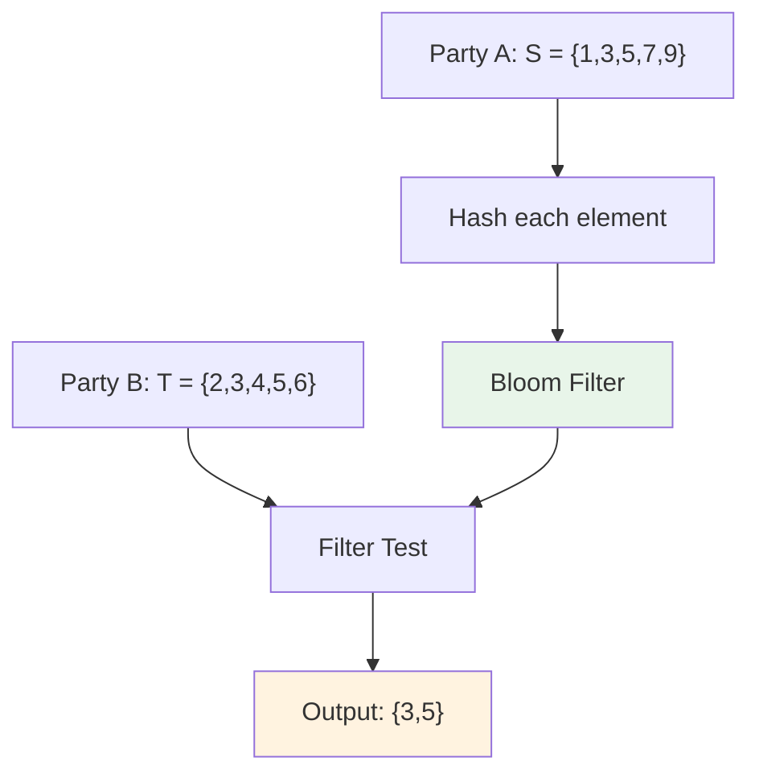

**OpenSSL:** Not supported (external libs: PSI protocols)

---

## 4. Commitment Schemes

**What it is:** Cryptographic primitive allowing one to commit to a value while keeping it hidden, later revealing.

**Math Example:**

```
Pedersen Commitment:
  Commit: C = g^x · h^r  (choose random r)
  Open: reveal (x, r), verifier checks C = g^x·h^r

Property: Hiding (C reveals nothing) + Binding (cannot change x)
```

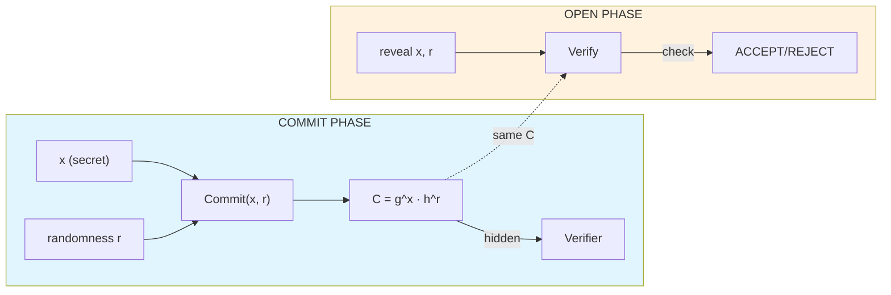

**OpenSSL:** Limited (custom impl only)

---

## 5. Secure Multi-Party Computation (MPC)

**What it is:** Protocols enabling parties to jointly compute a function over their inputs while keeping inputs private.

**Math Example:**

```
Yao's Garbled Circuits:
  Party A: Garble circuit C for f(x,y)
  Party B: OT for input, evaluate
  
SPDZ Protocol:
  Secret share inputs → Compute on shares → Reconstruct
```

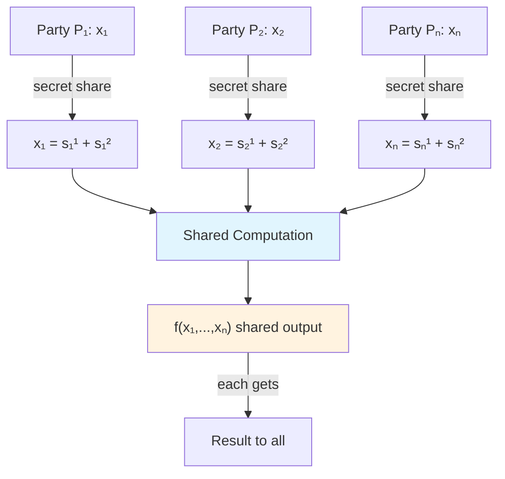

**OpenSSL:** Not supported (external libs: MPySC, SCALE-Mamba)

---

## 6. Proxy Re-Encryption (PRE)

**What it is:** Encryption allowing a proxy to transform ciphertext from one key to another WITHOUT seeing plaintext.

**Math Example:**

```
PRE based on RSA:
  Encrypt: C = m^e mod n (for A)
  ReKey: rk = (d₁/d₂) mod λ
  Transform: C' = C^rk = m^(e·rk) = m^d₁ mod n
```

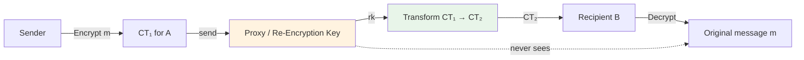

**OpenSSL:** Not supported (external libs: IBM PRE)

---

## 7. Verifiable Random Functions (VRF)

**What it is:** Function that produces random-looking output that's verifiable as authentic without revealing the seed.

**Math Example:**

```
EC-VRF:
  KeyGen: secret s, public Y = s·G
  Compute: H = s·P (appears random)
  Prove: π = [P, s·Hash(P)]
  Verify: e(π₁, G) = e(Hash(P), Y)
```

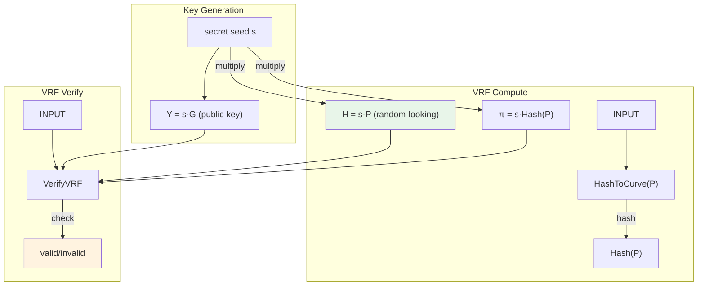

**OpenSSL:** Limited (custom impl)

---

## 8. Aggregate Signatures

**What it is:** Signatures that can be combined into a shorter single signature verifying multiple messages.

**Math Example:**

```
BLS Aggregation:
  Sign: σᵢ = sᵢ · H(mᵢ)
  Aggregate: σ = Σ σᵢ
  Verify: e(σ, G) = e(Σ pkᵢ, H(m))
```

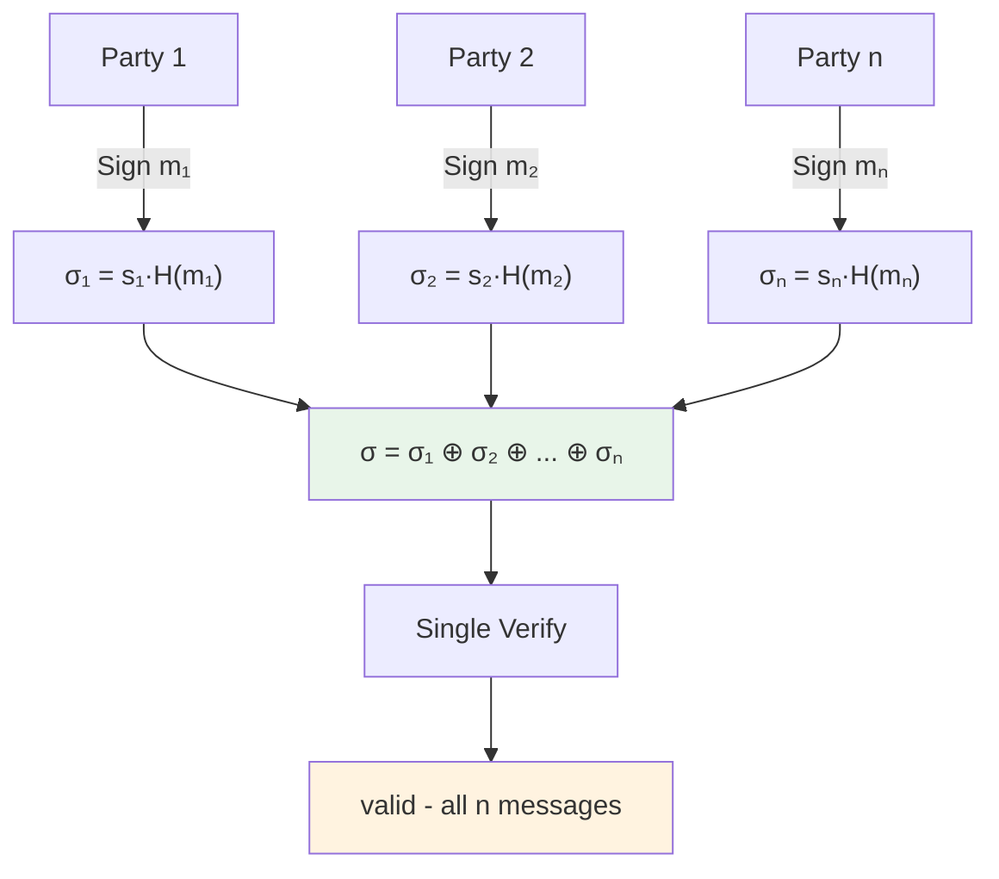

**OpenSSL:** Not supported (BLS not in OpenSSL)

---

## 9. Password-Hardened Encryption (PHE)

**What it is:** Encryption where password contributes to key derivation, combining password with cryptographic key.

**Math Example:**

```
Two-Factor:
  K₁ = KeyGen() (random)
  K₂ = Argon2(password)
  K = K₁ ⊕ K₂
  CT = Enc(K, m) + Enc(K₁, K₂)
```

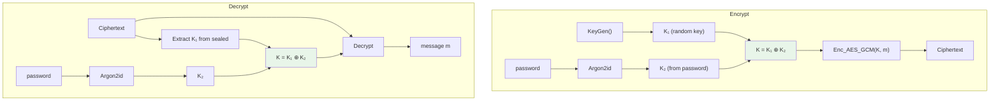

**OpenSSL:** Not supported (custom protocol)

---

## 10. Proof of Reserve (PoR)

**What it is:** Cryptographic proof that a custodian holds backing assets (e.g., for stablecoins).

**Math Example:**

```
Merkle Sum Tree:
  Leaves: balance[i]
  Root: Σ balance[i] = Total reserves
  Proof: Merkle path → verify sum matches root
```

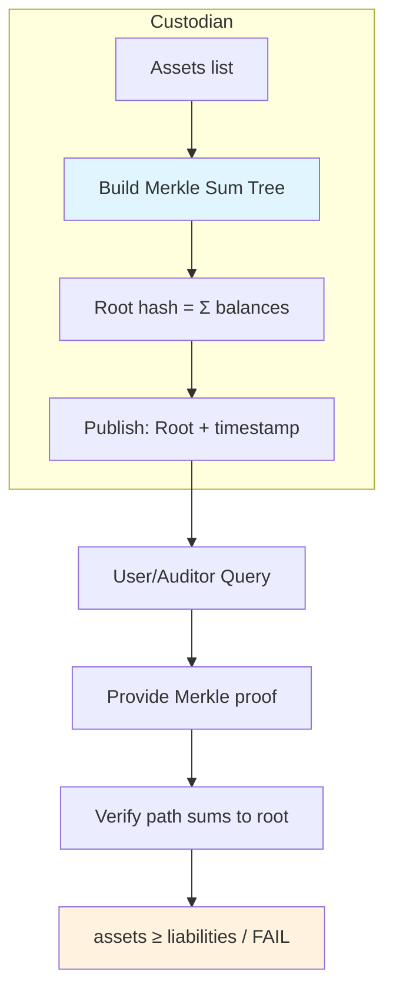

**OpenSSL:** Not supported (external oracle integrations)

---

## Summary: Collision Analysis

| Domain | Base Algos Used | New Primitive? | Collision? |
|--------|---------------|----------------|-------------|
| ZKP | sha256, ed25519 | YES (proof) | NO |
| FE | aes, pairings | YES (partial decrypt) | NO |
| PSI | sha256, aes, ot | YES (protocol) | NO |
| Commitment | sha256, ec | YES (binding) | NO |
| MPC | aes, hash, ot | YES (model) | NO |
| PRE | rsa, ec | YES (transform) | NO |
| VRF | sha256, ecdsa | YES (verifiable randomness) | NO |
| Aggregate | blake2b (BLS) | PARTIAL | MINOR |
| PHE | argon2, aes | YES (protocol) | NO |
| PoR | sha256, ed25519 | YES (protocol) | NO |

---

## 11. Additional NIST-Approved Domains (from SP 800-140C / CAVP)

### 11.1 KDF Variants

| Algorithm | NIST Standard | OpenSSL | ALGO.md |
|-----------|-------------|--------|---------|
| `hkdf` | SP 800-56Cr2 | YES | YES |
| `tls-kdf` | SP 800-135 | YES | NO |
| `ssh-kdf` | RFC 4253 | YES | NO |
| `pbkdf2` | SP 800-132 | YES | YES |
| `scrypt` | - | YES | YES |
| `argon2id` | - | YES | YES |

### 11.2 Key Agreement / KAS

| Algorithm | NIST Standard | OpenSSL | ALGO.md |
|-----------|-------------|--------|---------|
| `x25519` | SP 800-56A | YES | YES |
| `x448` | SP 800-56A | YES | YES |
| `p-256`, `p-384`, `p-521` | SP 800-56A | YES | YES |
| `rsa` | SP 800-56B | YES | YES |

### 11.3 Digital Signatures

| Algorithm | FIPS Standard | OpenSSL | ALGO.md |
|-----------|-------------|--------|---------|
| `rsa` | FIPS 186-5 | YES | YES |
| `ecdsa` | FIPS 186-5 | YES | YES |
| `ed25519` | FIPS 186-5 | YES | YES |
| `ed448` | FIPS 186-5 | YES | Conditional |
| `ml-dsa-44/65/87` | FIPS 204 | YES | YES |
| `slh-dsa-*` | FIPS 205 | YES | YES |
| `lms` | SP 800-208 | YES | NO |

### 11.4 DRBG / RNG

| Algorithm | SP 800-90A | OpenSSL | ALGO.md |
|-----------|-----------|--------|---------|
| `hash-drbg` | YES | YES (default) | NO |
| `hmac-drbg` | YES | Internal | NO |
| `ctr-drbg` | YES | YES | NO |

### 11.5 Ascon (Lightweight)

| Algorithm | SP 800-232 | OpenSSL | ALGO.md |
|-----------|------------|--------|---------|
| `ascon-hash256` | New | YES (3.x) | NO |
| `ascon-xof128` | New | YES | NO |
| `ascon-aead128` | New | YES | NO |

---

## 12. ALGO.md vs OpenSSL Coverage

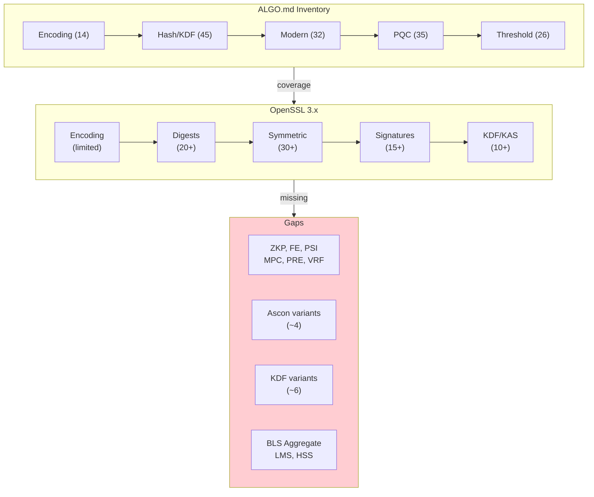

### Coverage Summary

| Category | ALGO.md | OpenSSL | Gap |
|----------|--------|--------|-----|
| Encoding | 14 | ~6 | ~8 |
| Hash/KDF | 45 | ~20 | ~15 |
| Modern | 32 | ~30 | ~2 |
| PQC | 35 | ~20 | ~15 |
| Threshold | 26 | ~3 | ~23 |
| NIST KDF | 10 | ~8 | ~2 |
| Total | 162+ | ~87 | ~65 |

### Conclusion

- Many domains (ZKP, MPC, PRE, VRF, Aggregate) NOT in OpenSSL - rely on external libs
- Ascon: Recently added (OpenSSL 3.x)
- Encoding: OpenSSL has minimal coverage (limited to base64)
- BLS Aggregate, LMS/HSS: Not in standard OpenSSL (only in external forks)
