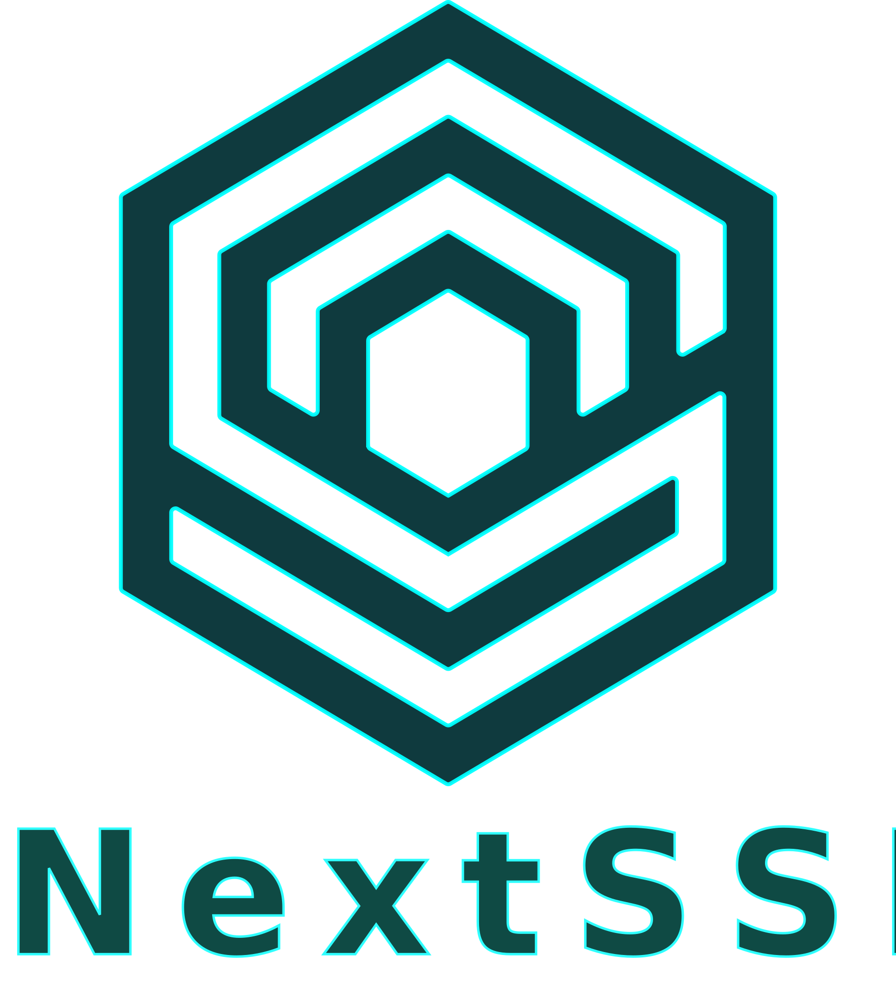

<div align="center">
  
  <br/><br/>


</div>


> ---
> ⚠️ WARNING
>> This repository is under active development — APIs and features may change without notice.
> ---


# NextSSL
**Next Super Secure Layer**

NextSSL is a security-first cryptographic library designed for the post-quantum era with a revolutionary 4-layer interface architecture. It provides everything from ultra-simple one-line APIs to low-level primitives, making it suitable for both beginners and cryptography experts.

## ✨ What Makes NextSSL Different?

### 🎯 Progressive Complexity - Choose Your Layer

NextSSL offers **4 API layers** - start simple, go deep when needed:

1. **Layer 4 (Primary)** - Ultra-Simple Unified API
   ```c
   #include "primary/nextssl.h"
   
   nextssl_encrypt(key, plaintext, len, ciphertext, &out_len);  // Done!
   ```

2. **Layer 3 (Main)** - High-Level APIs
   ```c
   #include "main/aead.h"
   
   nextssl_aead_encrypt(key, 32, plaintext, len, ciphertext, &out_len);
   ```

3. **Layer 2 (Base)** - Category Aggregations
   ```c
   #include "base/core.h"
   
   nextssl_base_aead_aes256gcm_encrypt(key, nonce, plaintext, len, ...);
   ```

4. **Layer 1 (Partial)** - Low-Level Primitives (Hidden)
   - Internal implementation details, not exposed to users

**Most users never go below Layer 3.** Start with Layer 4 for maximum simplicity!

### 🔒 Security First

- **Constant-time operations** for side-channel resistance
- **Secure defaults**: AES-256-GCM, SHA-256, Argon2id, X25519, Ed25519
- **Automatic nonce generation** - no foot-guns
- **Memory safety**: Secure zero, bounds checking
- **NIST/RFC compliant**: FIPS 180-4, 202, 203, 204, RFC 7748, 8032, 9106

### 📦 Two Build Variants

Choose the right size for your needs:

- **Lite (Default)**: 9 algorithms, 1 binary (~500KB)
  - Perfect for 99% of applications
  - Fast compilation and smaller binary size
  
- **Full**: 134 algorithms, 56 binaries (~5MB)
  - Post-quantum crypto (ML-KEM, ML-DSA)
  - Legacy algorithms (SHA-1, MD5, 3DES) properly isolated
  - Specialized algorithms (yescrypt, Equihash, RandomX)

## 📚 Documentation

- **[Build Guide](BUILD.md)**: Comprehensive build and installation instructions
- **[Quick Start Example](examples/example_quickstart.c)**: Get started in 5 minutes
- **[Algorithm Catalog](ALGORITHM.md)**: Complete reference of supported algorithms
- **[Source Map](SOURCE.md)**: Navigate the source code structure
- **[Security Policy](SECURITY.md)**: Vulnerability reporting and supported versions
- **[Release Notes](note/vBeta.md)**: Current beta release notes

## 🚀 Quick Start

### Prerequisites
- **CMake** 3.15+
- **C Compiler**: GCC 4.8+, Clang 3.4+, or MSVC 2015+
- **Python** 3.7+ (optional, for testing)

### Build in 3 Commands

```bash
cmake -B build -DCMAKE_BUILD_TYPE=Release
cmake --build build
./build/examples/example_quickstart
```

See **[BUILD.md](BUILD.md)** for detailed instructions, cross-compilation, and advanced options.

### Your First Program

```c
#include "primary/nextssl.h"
#include <stdio.h>

int main(void) {
    uint8_t hash[32];
    const char *message = "Hello, NextSSL!";
    
    nextssl_init();
    nextssl_hash((uint8_t*)message, strlen(message), hash);
    
    printf("SHA-256: ");
    for (int i = 0; i < 32; i++) printf("%02x", hash[i]);
    printf("\n");
    
    nextssl_cleanup();
    return 0;
}
```

Compile and run:
```bash
gcc your_app.c -lnextssl -o your_app
./your_app
```

## 🎯 Key Features

### Modern Cryptography
- **Encryption**: AES-256-GCM, ChaCha20-Poly1305, AES-GCM-SIV
- **Hashing**: SHA-256/512, SHA3-256/512, BLAKE2b/s, BLAKE3
- **Password Hashing**: Argon2id, scrypt, bcrypt (OWASP 2023 compliant)
- **Key Exchange**: X25519, X448, ECDH P-256
- **Signatures**: Ed25519, ECDSA P-256

### Post-Quantum Ready (Full Variant)
- **KEM**: ML-KEM-768/1024 (NIST FIPS 203)
- **Signatures**: ML-DSA-65/87 (NIST FIPS 204)

### Developer Experience
- **Simple APIs**: One-line encryption, hashing, password verification
- **Safe Defaults**: No configuration needed, just works
- **Hard to Misuse**: Automatic nonce handling, constant-time verification
- **Comprehensive Examples**: 15+ example programs included
- **Python Bindings**: PyPI package available (`nextssl` / `nextssl-full`)

## 🛠️ Build System

NextSSL supports both **CMake** (recommended) and **Python runner** (legacy).

### CMake (New, Recommended)

```bash
# Lite variant (default)
cmake -B build
cmake --build build

# Full variant (all algorithms)
cmake -B build -DNEXTSSL_BUILD_VARIANT=full
cmake --build build

# Run tests
cd build && ctest --output-on-failure

# Install
sudo cmake --install build
```

### Python Runner (Legacy)

```bash
python runner.py                    # Build and test
python runner.py --build hash       # Build hash primitives
python runner.py --test core:aead   # Test AEAD modes
```

See **[BUILD.md](BUILD.md)** for complete build options and troubleshooting.

## 🔒 Security

Security is our top priority. Please see **[SECURITY.md](SECURITY.md)** for our reporting policy and supported versions.

## 🤝 Contributing

We welcome contributions! Please read **[CONTRIBUTING.md](CONTRIBUTING.md)** for details on our code of conduct and the process for submitting pull requests.

---
*NextSSL — A private Leyline for proper security, whether it's for a server, AI, human, or your pet frog.*
