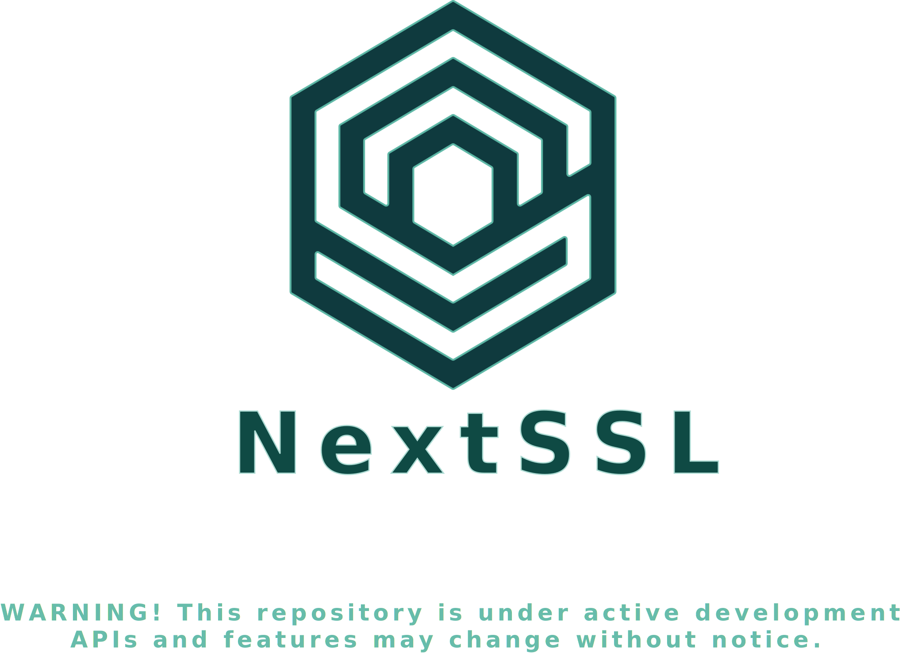
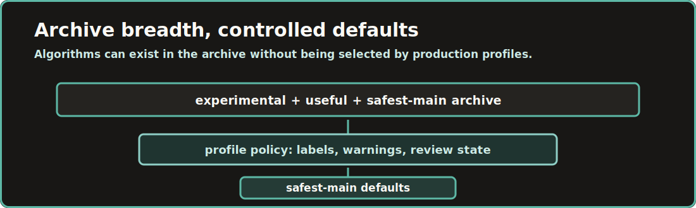
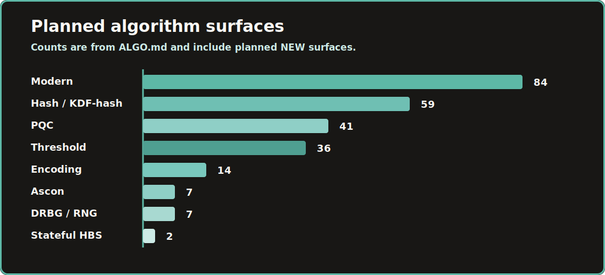
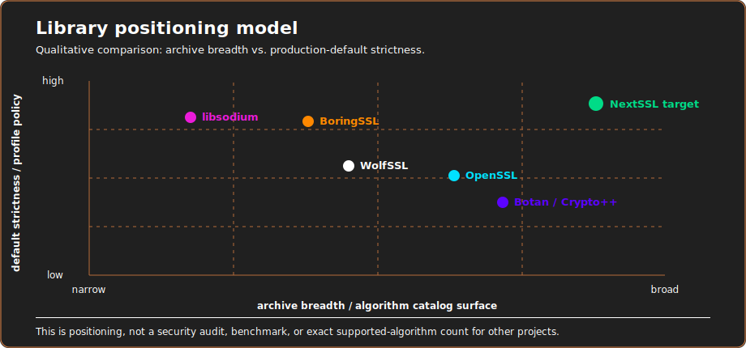
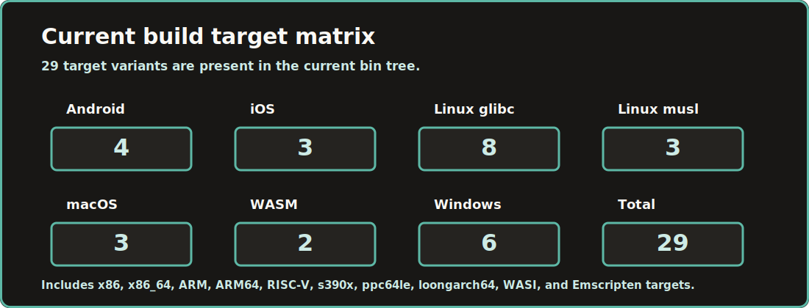

<div align="center">
   
</div>

# NextSSL

**Next Super Secure Layer** is an under-development crypto archive and safety-profile toolkit.

[](LICENSE)


NextSSL is being designed as one repo with three clear domains: `experimental`, `useful`, and `safest-main`. Researchers can add and study algorithms, while normal users should get safe defaults through profiles.

> Status: under active development. Planned algorithm surfaces are not the same as implemented production code.

## The Shape

<div align="center">
   
</div>

NextSSL should be wide inside and careful outside:

- Broad archive: catalog algorithms, variants, research candidates, legacy systems, and ecosystem-specific primitives.
- Safe profiles: default to conservative choices unless the user explicitly customizes policy.
- Contributor workflow: use issues, references, test vectors, and review to promote algorithms between domains.

Full details live in [PLAN.md](PLAN.md). Current inventory lives in [ALGO.md](ALGO.md).

## Algorithm Surface

<div align="center">
   
</div>

Current archive inventory: **249 planned algorithm surfaces across 8 groups**.

| Group | Count | Notes |
| --- | ---: | --- |
| Encoding | 14 | Encodings and checksum helpers |
| Hash / KDF-hash | 59 | Hashes, XOFs, KMAC, password hashes |
| Modern | 83 | AEAD, MAC, KDF, signatures, curves, KEX |
| PQC | 41 | KEMs, signatures, and adjacent PQC candidates |
| Threshold | 36 | Threshold signatures, MPC, VSS, DKG |
| Ascon | 7 | Lightweight AEAD, hash, XOF, MAC, PRF |
| DRBG / RNG | 7 | DRBGs and randomness infrastructure |
| Stateful HBS | 2 | LMS and XMSS |

Entries marked `**[NEW]**` in [ALGO.md](ALGO.md) are planned surfaces to add or expose. They are not claims of completed implementation.

## Library Positioning

<div align="center">
   
</div>

NextSSL is not trying to replace mature production libraries today. Its target is different: archive breadth, explicit profiles, and a contribution model where algorithms can be studied without becoming defaults.

The graph is a project-positioning model, not a benchmark. Established libraries such as OpenSSL, BoringSSL, libsodium, Botan, Crypto++, wolfSSL, and mbedTLS remain far ahead in production maturity, audit history, and deployment.

## Profiles

Profiles are planned as customizable safety policies.

```js
const NP = NextSSL.profile.safest();

NP.default.hash = NextSSL.root.hash.sha256;
NP.default.aead = NextSSL.root.modern["xchacha20-poly1305"];
NP.default.signature = NextSSL.root.modern.ed25519;

// Allowed only as an explicit expert override with policy warnings.
NP.default.hash = NextSSL.root.hash.md5;
```

Planned profile families:

| Profile | Purpose |
| --- | --- |
| `safest` | Conservative defaults for normal users |
| `compatibility` | Legacy and migration support with warnings |
| `research` | Experimental algorithms and review hooks |
| `archive` | Full catalog inspection |
| `pqc` | Post-quantum and hybrid migration work |

## Platform Targets

<div align="center">
   
</div>

The current `bin` layout contains **29 target variants**:

| Family | Targets |
| --- | --- |
| Android | `arm64-v8a`, `armeabi-v7a`, `x86`, `x86_64` |
| iOS | `device-arm64`, `sim-arm64`, `sim-x86_64` |
| Linux glibc | `arm64`, `armv7`, `loongarch64`, `ppc64le`, `riscv64`, `s390x`, `x86`, `x86_64` |
| Linux musl | `arm64`, `armv7`, `x86_64` |
| macOS | `arm64`, `universal`, `x86_64` |
| WASM | `emscripten-wasm32`, `wasi-wasm32` |
| Windows | `arm64-msvc`, `armv7-msvc`, `x86-mingw`, `x86-msvc`, `x86_64-mingw`, `x86_64-msvc` |

Build documentation is still evolving. Start with [BUILD.md](BUILD.md).

## Docs

- [PLAN.md](PLAN.md): roadmap, profiles, lifecycle, safety labels, contribution model.
- [ALGO.md](ALGO.md): complete current inventory and planned surfaces.
- [BUILD.md](BUILD.md): build notes.
- [CONTRIBUTING.md](CONTRIBUTING.md): contribution guide.
- [SECURITY.md](SECURITY.md): security reporting policy.

## Build Target Tags


## Algorithm Tags


## Rule

Breadth belongs in the archive. Trust belongs in the defaults.

*NextSSL is building a crypto archive with a seatbelt: wide enough for research, strict enough for users.*
