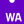

 

  

 

<table>
  <tr>
    <td bgcolor="#181715" align="center">
       
      <b>CRYPTO ARCHIVE + SAFETY-PROFILE TOOLKIT</b>
      <h1>NextSSL</h1>
      <h3>A wide crypto archive with safe defaults you can inspect.</h3>
      

        
          NextSSL is being built as a large crypto library for research, testing, and safer defaults.
          It tracks many algorithms, supports many platforms, and keeps risky choices away from normal users.
          The project is still under development, so the README is clear about what is planned and what is ready.
        
      

       
    </td>
  </tr>
</table>

<table>
  <tr>
    <td bgcolor="#252320" align="center"><b>250</b> planned algorithm surfaces</td>
    <td bgcolor="#252320" align="center"><b>8</b> inventory groups</td>
    <td bgcolor="#252320" align="center"><b>29</b> target variants</td>
    <td bgcolor="#252320" align="center"><b>3</b> core domains</td>
  </tr>
</table>

> **Status:** under active development. Planned algorithms, target badges, and profile names show the roadmap. They do not mean the project is production-ready or audited.

## Why NextSSL

<table>
  <tr>
    <td bgcolor="#181715">
      <b>TOP-TIER DIRECTION</b> 
      <b>Many algorithms, but safer defaults.</b> 
      NextSSL can keep many algorithms in one place without making all of them default choices. The archive can be wide, while the default profile stays careful.
    </td>
    <td bgcolor="#252320">
      <b>SECURITY POSTURE</b> 
      <b>Defaults should be reviewed.</b> 
      Experimental and old algorithms can stay in the archive. They should not become normal defaults unless the project clearly allows them.
    </td>
    <td bgcolor="#1f3430">
      <b>PORTABILITY</b> 
      <b>Built for many platforms.</b> 
      The current layout tracks desktop, mobile, Linux, Windows, and WASM targets from the start.
    </td>
  </tr>
</table>

## The Model

<table>
  <tr>
    <td bgcolor="#181715">
      <h3>Big archive. Small safe-default set. Clear review path.</h3>
      

        
          NextSSL is organized around three areas: <code>experimental</code>,
          <code>useful</code>, and <code>safest-main</code>. Algorithms can be listed,
          studied, tested, and improved without becoming safe defaults by accident.
        
      

      

        
          Simple rule: keep the archive wide, and keep defaults strict.
        
      

    </td>
  </tr>
</table>

<table>
  <tr>
    <td bgcolor="#181715" align="center">
      
    </td>
  </tr>
</table>

## Algorithm Surface

<table>
  <tr>
    <td bgcolor="#181715" align="center">
      
    </td>
  </tr>
</table>

Current archive inventory: **250 planned algorithm surfaces across 8 groups**.

| Group | Count | Purpose |
| --- | ---: | --- |
| Modern | 84 | AEAD, MAC, KDF, signatures, curves, and key exchange work |
| Hash / KDF-hash | 59 | Hashes, XOFs, KMAC, and password-hash related surfaces |
| PQC | 41 | KEMs, signatures, and adjacent post-quantum candidates |
| Threshold | 36 | Threshold signatures, MPC, VSS, DKG, and related protocols |
| Encoding | 14 | Encodings and checksum helpers |
| Ascon | 7 | Lightweight AEAD, hash, XOF, MAC, and PRF surfaces |
| DRBG / RNG | 7 | DRBGs and randomness infrastructure |
| Stateful HBS | 2 | LMS and XMSS |

Entries marked `NEW` in [ALGO.md](ALGO.md) are planned items. They do not mean the code is finished.

## Safety Profiles

<table>
  <tr>
    <td bgcolor="#181715">
      <b>SAFEST</b> 
      <b>Safe defaults for normal users.</b> 
      The default profile should use modern, reviewed choices and avoid old or risky ones.
    </td>
    <td bgcolor="#252320">
      <b>COMPATIBILITY</b> 
      <b>Old-system support with warnings.</b> 
      Older algorithms can be available for compatibility, but they should be clearly marked.
    </td>
    <td bgcolor="#1f3430">
      <b>RESEARCH</b> 
      <b>Experimental algorithms for study.</b> 
      Researchers can inspect candidates, add references, and help move good choices forward.
    </td>
  </tr>
</table>

| Profile | Purpose |
| --- | --- |
| `safest` | Safe defaults for normal users |
| `compatibility` | Legacy and migration support with warnings |
| `research` | Experimental algorithms and review hooks |
| `archive` | Full catalog inspection |
| `pqc` | Post-quantum and hybrid migration work |

## Library Positioning

<table>
  <tr>
    <td bgcolor="#181715">
      <h3>Aiming high, while being honest.</h3>
      

        
          NextSSL is not claiming to replace OpenSSL, BoringSSL, libsodium, Botan, Crypto++,
          wolfSSL, or mbedTLS today. Those projects are older, more tested, and used in real systems.
        
      

      

        
          The goal is different: become a useful crypto toolkit for people who want a big algorithm list
          plus strict defaults.
        
      

    </td>
  </tr>
</table>

<table>
  <tr>
    <td bgcolor="#181715" align="center">
      
    </td>
  </tr>
</table>

## Platform Targets

<table>
  <tr>
    <td bgcolor="#181715" align="center">
      
    </td>
  </tr>
</table>

The current `bin` layout contains **29 target variants**. Build docs are still changing; start with [BUILD.md](BUILD.md).

| Family | Targets |
| --- | --- |
| Android | `arm64-v8a`, `armeabi-v7a`, `x86`, `x86_64` |
| iOS | `device-arm64`, `sim-arm64`, `sim-x86_64` |
| Linux glibc | `arm64`, `armv7`, `loongarch64`, `ppc64le`, `riscv64`, `s390x`, `x86`, `x86_64` |
| Linux musl | `arm64`, `armv7`, `x86_64` |
| macOS | `arm64`, `universal`, `x86_64` |
| WASM | `emscripten-wasm32`, `wasi-wasm32` |
| Windows | `arm64-msvc`, `armv7-msvc`, `x86-mingw`, `x86-msvc`, `x86_64-mingw`, `x86_64-msvc` |

## Project Docs

<table>
  <tr>
    <td bgcolor="#181715"><a href="PLAN.md"><b>PLAN.md</b></a> Roadmap, profiles, safety labels, and contribution flow.</td>
    <td bgcolor="#252320"><a href="ALGO.md"><b>ALGO.md</b></a> Complete current inventory and planned surfaces.</td>
    <td bgcolor="#1f3430"><a href="BUILD.md"><b>BUILD.md</b></a> Build notes and target guidance.</td>
  </tr>
  <tr>
    <td bgcolor="#1f3430"><a href="CONTRIBUTING.md"><b>CONTRIBUTING.md</b></a> How to add and review algorithms.</td>
    <td bgcolor="#252320"><a href="SECURITY.md"><b>SECURITY.md</b></a> Security reporting policy.</td>
    <td bgcolor="#181715"><a href="LICENSE"><b>LICENSE</b></a> Apache-2.0.</td>
  </tr>
</table>

## Target Tags

<table>
  <tr>
    <td bgcolor="#181715"> <b>glibc</b></td>
    <td bgcolor="#252320"><code>arm64</code> <code>armv7</code> <code>loongarch64</code> <code>ppc64le</code> <code>riscv64</code> <code>s390x</code> <code>x86</code> <code>x86_64</code></td>
  </tr>
  <tr>
    <td bgcolor="#181715"> <b>musl</b></td>
    <td bgcolor="#252320"><code>arm64</code> <code>armv7</code> <code>x86_64</code></td>
  </tr>
  <tr>
    <td bgcolor="#181715"> <b>MSVC / MinGW</b></td>
    <td bgcolor="#252320"><code>arm64-msvc</code> <code>armv7-msvc</code> <code>x86-mingw</code> <code>x86-msvc</code> <code>x86_64-mingw</code> <code>x86_64-msvc</code></td>
  </tr>
  <tr>
    <td bgcolor="#181715"> <b>Android</b></td>
    <td bgcolor="#252320"><code>arm64-v8a</code> <code>armeabi-v7a</code> <code>x86</code> <code>x86_64</code></td>
  </tr>
  <tr>
    <td bgcolor="#181715"> <b>iOS</b></td>
    <td bgcolor="#252320"><code>device-arm64</code> <code>sim-arm64</code> <code>sim-x86_64</code></td>
  </tr>
  <tr>
    <td bgcolor="#181715"> <b>macOS</b></td>
    <td bgcolor="#252320"><code>arm64</code> <code>universal</code> <code>x86_64</code></td>
  </tr>
  <tr>
    <td bgcolor="#181715"> <b>WASM</b></td>
    <td bgcolor="#252320"><code>emscripten-wasm32</code> <code>wasi-wasm32</code></td>
  </tr>
</table>

## Algorithm Tags

<table>
  <tr>
    <td bgcolor="#5db8a6" align="center">
      <h2>Keep the archive wide. Keep the defaults strict.</h2>
      
<b>NextSSL is building toward top-tier crypto-library status with a big algorithm catalog and clear safety profiles.</b>

    </td>
  </tr>
</table>
