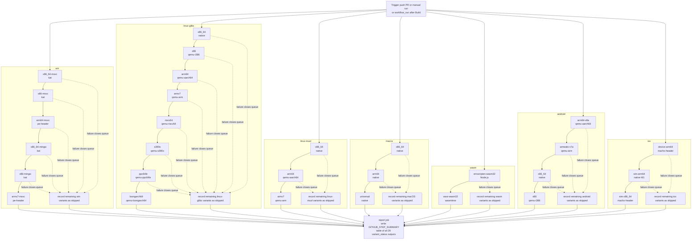

# Test CI Flow

## Status

This file describes the workflow that is now implemented in `.github/workflows/test.yml` and `.github/workflows/test-variant.yml`.

The test CI has seven visible platform groups plus the final report job:

- `win`
- `linux-glibc`
- `linux-musl`
- `macos`
- `wasm`
- `android`
- `ios`
- `report`

Each variant is its own GitHub Actions job that calls `test-variant.yml` (reusable workflow), so the Actions UI shows per-variant progress directly.

## Current Behavior

- The workflow starts one queue per platform group in parallel.
- Inside a platform group, variants are chained one after another as visible jobs.
- The first failed variant closes that platform queue.
- Remaining jobs in that platform queue still run, but they record `status: skipped` logs instead of attempting a test.
- There is no flag gate. Every trigger (push, pull request, manual, or `workflow_run` after Build) runs all queues.
- When triggered via `workflow_run`, each job receives the exact `run_id` of the originating build run so the artifact download is pinned to that specific run.
- Each variant job downloads the binary artifact produced by `build.yml`, runs the appropriate test, and uploads `logs/test/<platform>/<variant>/` as its log artifact.
- Logs are uploaded with `if: always()` — a failed test or missing artifact never prevents log collection.
- Each variant job writes a `result.txt` in the same format as `ci_runner.py` so `ci_merge_logs.py` can produce per-platform `SUMMARY.txt` files.
- The `report` job always runs after all 29 variants and writes a Markdown summary table to `GITHUB_STEP_SUMMARY`.

## Platform Queues

- `win`: `x86_64-msvc -> x86-msvc -> arm64-msvc -> x86_64-mingw -> x86-mingw -> armv7-msvc`
- `linux-glibc`: `x86_64 -> x86 -> arm64 -> armv7 -> riscv64 -> s390x -> ppc64le -> loongarch64`
- `linux-musl`: `x86_64 -> arm64 -> armv7`
- `macos`: `x86_64 -> arm64 -> universal`
- `wasm`: `emscripten-wasm32 -> wasi-wasm32`
- `android`: `arm64-v8a -> armeabi-v7a -> x86_64 -> x86`
- `ios`: `device-arm64 -> sim-arm64 -> sim-x86_64`

## Platform Groups

- `win`: `x86_64-msvc (kat)` | `x86-msvc (kat)` | `arm64-msvc (pe-header)` | `x86_64-mingw (kat)` | `x86-mingw (kat)` | `armv7-msvc (pe-header)`
- `linux-glibc`: `x86_64 (native)` | `x86 (qemu-i386)` | `arm64 (qemu-aarch64)` | `armv7 (qemu-arm)` | `riscv64 (qemu-riscv64)` | `s390x (qemu-s390x)` | `ppc64le (qemu-ppc64le)` | `loongarch64 (qemu-loongarch64)`
- `linux-musl`: `x86_64 (native)` | `arm64 (qemu-aarch64)` | `armv7 (qemu-arm)`
- `macos`: `x86_64 (native)` | `arm64 (native)` | `universal (native)`
- `wasm`: `emscripten-wasm32 (node)` | `wasi-wasm32 (wasmtime)`
- `android`: `arm64-v8a (qemu-aarch64)` | `armeabi-v7a (qemu-arm)` | `x86_64 (native)` | `x86 (qemu-i386)`
- `ios`: `device-arm64 (macho-header)` | `sim-arm64 (native M1)` | `sim-x86_64 (macho-header)`

## Test Modes

- `kat` — run `test/run_tests.py --lib` (native or via `QEMU_LD_PREFIX` for cross-arch glibc)
- `wasm-node` — run `test/run_tests.py --wasm` via Node.js (emscripten)
- `wasm-wasi` — run `test/run_tests.py --wasm-wasi` via wasmtime
- `pe-header` — verify MZ magic bytes only; execution skipped (Windows ARM cross-arch)
- `macho-header` — verify Mach-O magic bytes only; execution skipped (iOS device / sim-x86_64)

## Layout Contract

- Test logs: `logs/test/<platform>/<variant>/`
- Build logs: `logs/build/<platform>/<variant>/`

Each variant log directory contains `kat.log` or `header.log` plus `result.txt`.

## Mermaid

## Notes

- The reusable workflow lives in `.github/workflows/test-variant.yml`.
- Queue stop behavior is enforced by workflow chaining: `should_test` is set false for a variant when the previous result was not `success` or `continue_queue` was not `true`.
- The `report` job reads `needs.<job>.outputs.variant_status` rather than the raw GitHub job result, so the summary shows `success / failed / skipped` based on the internal test outcome.
- `build/ci_merge_logs.py` handles both the legacy 3-part artifact name (`logs__<platform>__<variant>`) and the current 4-part name (`logs__<type>__<platform>__<variant>`).
- The `collect` job in `build.yml` downloads `logs__*` (covering both `logs__build__*` and `logs__test__*`) and merges everything into `<type>/<platform>/<variant>/` before publishing to the repo.

